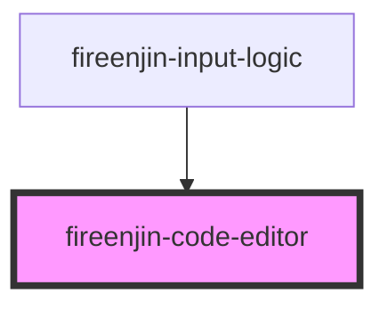

# code-editor

<!-- Auto Generated Below -->

## Properties

| Property        | Attribute        | Description | Type                                                                                                                                                                                               | Default                                                  |
| --------------- | ---------------- | ----------- | -------------------------------------------------------------------------------------------------------------------------------------------------------------------------------------------------- | -------------------------------------------------------- |
| `autoExpand`    | `auto-expand`    |             | `boolean`                                                                                                                                                                                          | `false`                                                  |
| `debounceTimer` | `debounce-timer` |             | `number`                                                                                                                                                                                           | `500`                                                    |
| `disableEmmet`  | `disable-emmet`  |             | `boolean`                                                                                                                                                                                          | `false`                                                  |
| `disableFocus`  | `disable-focus`  |             | `boolean`                                                                                                                                                                                          | `false`                                                  |
| `indentSpaces`  | `indent-spaces`  |             | `number`                                                                                                                                                                                           | `4`                                                      |
| `language`      | `language`       |             | `string`                                                                                                                                                                                           | `"html"`                                                 |
| `minimap`       | --               |             | `{ enabled?: boolean; side?: "right" \| "left"; size?: "fill" \| "proportional" \| "fit"; showSlider?: "always" \| "mouseover"; renderCharacters?: boolean; maxColumn?: number; scale?: number; }` | `{     enabled: false,   }`                              |
| `monacoVsPath`  | `monaco-vs-path` |             | `string`                                                                                                                                                                                           | `undefined`                                              |
| `name`          | `name`           |             | `string`                                                                                                                                                                                           | `"code"`                                                 |
| `options`       | `options`        |             | `any`                                                                                                                                                                                              | `{     formatOnPaste: true,     formatOnType: true,   }` |
| `outputObject`  | `output-object`  |             | `boolean`                                                                                                                                                                                          | `false`                                                  |
| `readOnly`      | `read-only`      |             | `boolean`                                                                                                                                                                                          | `false`                                                  |
| `theme`         | `theme`          |             | `string`                                                                                                                                                                                           | `"vs-dark"`                                              |
| `value`         | `value`          |             | `string`                                                                                                                                                                                           | `undefined`                                              |

## Events

| Event                 | Description | Type                               |
| --------------------- | ----------- | ---------------------------------- |
| `fireenjinCodeChange` |             | `CustomEvent<any>`                 |
| `fireenjinError`      |             | `CustomEvent<FireEnjinErrorEvent>` |

## Methods

### `checkEditorValue(event?: any, { onError, }?: { onError?: (data: { event?: any; name?: string; error: any; }) => Promise<void>; }) => Promise<any>`

#### Returns

Type: `Promise<any>`

### `format() => Promise<void>`

#### Returns

Type: `Promise<void>`

### `getPosition() => Promise<any>`

#### Returns

Type: `Promise<any>`

### `getValue(options: any) => Promise<string>`

#### Returns

Type: `Promise<string>`

### `resize() => Promise<void>`

#### Returns

Type: `Promise<void>`

### `setFocus() => Promise<boolean>`

#### Returns

Type: `Promise<boolean>`

### `setPosition(options: any) => Promise<void>`

#### Returns

Type: `Promise<void>`

### `updateOptions(options: any) => Promise<void>`

#### Returns

Type: `Promise<void>`

## Dependencies

### Used by

 - fireenjin-input-logic

### Graph

----------------------------------------------

*Built with [StencilJS](https://stenciljs.com/)*
