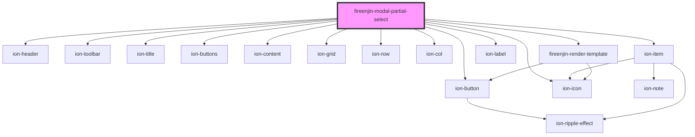

# fireenjin-modal-partial-select

<!-- Auto Generated Below -->

## Properties

| Property   | Attribute  | Description | Type     | Default     |
| ---------- | ---------- | ----------- | -------- | ----------- |
| `blockId`  | `block-id` |             | `string` | `undefined` |
| `partials` | --         |             | `any[]`  | `undefined` |

## Methods

### `selectPartial(partial: any, event?: any) => Promise<void>`

#### Returns

Type: `Promise<void>`

## Dependencies

### Depends on

- ion-header
- ion-toolbar
- ion-title
- ion-buttons
- ion-button
- ion-icon
- ion-content
- ion-grid
- ion-row
- ion-col
- ion-item
- ion-label
- [fireenjin-render-template](render-template)

### Graph

----------------------------------------------

*Built with [StencilJS](https://stenciljs.com/)*
