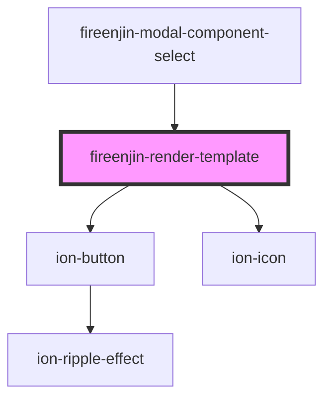

# fireenjin-render-template

<!-- Auto Generated Below -->

## Properties

| Property          | Attribute          | Description | Type                                                  | Default                                                                                                                                                                                                                                                                                                                                                                                                                        |
| ----------------- | ------------------ | ----------- | ----------------------------------------------------- | ------------------------------------------------------------------------------------------------------------------------------------------------------------------------------------------------------------------------------------------------------------------------------------------------------------------------------------------------------------------------------------------------------------------------------ |
| `allowFullscreen` | `allow-fullscreen` |             | `boolean`                                             | `false`                                                                                                                                                                                                                                                                                                                                                                                                                        |
| `customParsers`   | `custom-parsers`   |             | `any`                                                 | `undefined`                                                                                                                                                                                                                                                                                                                                                                                                                    |
| `data`            | `data`             |             | `any`                                                 | `{}`                                                                                                                                                                                                                                                                                                                                                                                                                           |
| `disableFrame`    | `disable-frame`    |             | `boolean`                                             | `false`                                                                                                                                                                                                                                                                                                                                                                                                                        |
| `disablePosition` | `disable-position` |             | `boolean`                                             | `false`                                                                                                                                                                                                                                                                                                                                                                                                                        |
| `embedMarkup`     | `embed-markup`     |             | `any`                                                 | `undefined`                                                                                                                                                                                                                                                                                                                                                                                                                    |
| `enableClicks`    | `enable-clicks`    |             | `boolean`                                             | `false`                                                                                                                                                                                                                                                                                                                                                                                                                        |
| `helpers`         | --                 |             | `{ [helperName: string]: any; }`                      | `{     formatUSD: (amount) => {       const formatter = new Intl.NumberFormat("en-US", {         style: "currency",         currency: "USD",         minimumFractionDigits: 2,       });        return formatter.format(amount ? amount : 0);     },     logic: (context, rules, tempData) =>       jsonLogic.apply(JSON.parse(rules.replace('"@tempData"', tempData)), {         ...context,         tempData,       }),   }` |
| `loading`         | `loading`          |             | `"eager" \| "lazy"`                                   | `"lazy"`                                                                                                                                                                                                                                                                                                                                                                                                                       |
| `name`            | `name`             |             | `string`                                              | `undefined`                                                                                                                                                                                                                                                                                                                                                                                                                    |
| `parserConfig`    | `parser-config`    |             | `any`                                                 | `undefined`                                                                                                                                                                                                                                                                                                                                                                                                                    |
| `partials`        | --                 |             | `{ [key: string]: any; id: string; html: string; }[]` | `[]`                                                                                                                                                                                                                                                                                                                                                                                                                           |
| `rawHtml`         | `raw-html`         |             | `string`                                              | `undefined`                                                                                                                                                                                                                                                                                                                                                                                                                    |
| `resize`          | `resize`           |             | `boolean`                                             | `false`                                                                                                                                                                                                                                                                                                                                                                                                                        |
| `template`        | `template`         |             | `any`                                                 | `{}`                                                                                                                                                                                                                                                                                                                                                                                                                           |
| `templateId`      | `template-id`      |             | `string`                                              | `undefined`                                                                                                                                                                                                                                                                                                                                                                                                                    |
| `zoom`            | `zoom`             |             | `number \| string`                                    | `1`                                                                                                                                                                                                                                                                                                                                                                                                                            |

## Events

| Event            | Description | Type                               |
| ---------------- | ----------- | ---------------------------------- |
| `fireenjinFetch` |             | `CustomEvent<FireEnjinFetchEvent>` |

## Methods

### `fetchData(input?: { templateId?: string; }) => Promise<void>`

#### Parameters

| Name    | Type                       | Description |
| ------- | -------------------------- | ----------- |
| `input` | `{ templateId?: string; }` |             |

#### Returns

Type: `Promise<void>`

### `fullscreen() => Promise<void>`

#### Returns

Type: `Promise<void>`

### `getFrameEl() => Promise<any>`

#### Returns

Type: `Promise<any>`

### `renderTemplate(html?: string) => Promise<void>`

#### Parameters

| Name   | Type     | Description |
| ------ | -------- | ----------- |
| `html` | `string` |             |

#### Returns

Type: `Promise<void>`

### `setHelpers(helpers?: { [helperName: string]: any; }) => Promise<void>`

#### Parameters

| Name      | Type                             | Description |
| --------- | -------------------------------- | ----------- |
| `helpers` | `{ [helperName: string]: any; }` |             |

#### Returns

Type: `Promise<void>`

### `setPartials(partials?: any[]) => Promise<void>`

#### Parameters

| Name       | Type    | Description |
| ---------- | ------- | ----------- |
| `partials` | `any[]` |             |

#### Returns

Type: `Promise<void>`

### `unsetPartials() => Promise<void>`

#### Returns

Type: `Promise<void>`

## Dependencies

### Used by

 - [fireenjin-modal-component-select](..)

### Depends on

- ion-button
- ion-icon

### Graph

----------------------------------------------

*Built with [StencilJS](https://stenciljs.com/)*
